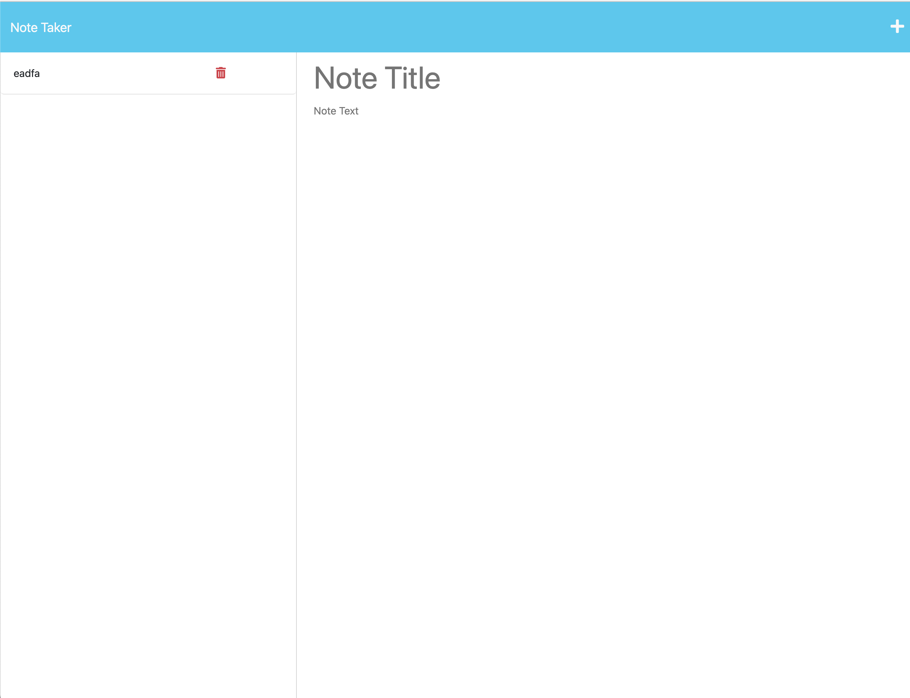

# Note-Taker
- First thing I did was copy over the pre-existing code for the assignment.
- After that I created a server.js file and loaded up all express and all of the other
npm files.
- Firstly I made the two app.get functions that loaded up the html from the front end.
- Had a bit of trouble getting the app.post to work, but using console logs I was able to find
the errors and get my code to push notes to the db.json file without issue.
- Next error was with creating the .get for the /api/notes, as it was being passed over.
- I reached out to BCS support but they told me to move the .get file to the top, which started
messing up the other .get requests.
- Finally in office hours I found that my .get for /* was cancelling the other ones that followed it,
so I moved it to the bottom.
- After that I made the code for pulling up previous notes, which I remade three different times,
but was having no luck until the T.A. Connor had me change my note_id references to just id, which immediately
fixed the problems.

Website link:

